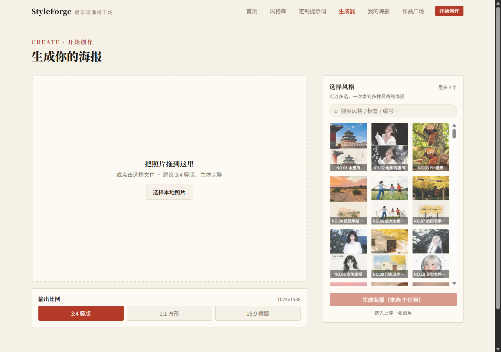

# StyleForge · 提示词海报工坊

> **挑选一个艺术风格，上传你的照片，一键生成同风格的艺术海报。**

StyleForge 是一个 AI 海报生成工具站：内置 **149 组经过验证的提示词模板**（覆盖水墨、彩铅、几何平涂、羊毛毡、版画、剪纸等 30+ 种风格，每组配真实样例图），用户不需要会写提示词——挑一张喜欢的样例，上传照片，就能得到同款风格的海报。还提供提示词拼装器与原创海报模板，覆盖从"改造照片"到"从零生成"的完整需求。


## ✨ 核心功能

### 1. 双板块风格库（149 组模板）

- **照片风格化**（147 组）：上传照片 → 上半区保留原片、下半区风格化重构，主打"废片拯救"
- **海报生成**（2 组）：无需照片，填空模板直接生成（城市文旅海报、东方美学人物海报）
- 搜索引擎式检索（实时联想 + 缩略图）、八维标签筛选、板块 Tab
- **提示词彩色高亮**：正文按分类上色（风格=朱砂红、版式=蓝、色彩=赭黄、禁忌=灰+删除线），一眼看懂提示词结构


### 2. 生成器（真实 AI 出图）

- 上传照片 → 多选风格（最多 3 个）→ 生成 → **before/after 滑动对照**
- 输出比例可选（3:4 / 1:1 / 16:9），比例不匹配模板时自动提示
- 风格搜索 + **收藏夹**（localStorage，跨页面同步）
- 服务端代理 OpenAI Images API（gpt-image 图生图），生成结果落盘 `public/generated/`，刷新不丢；未配置密钥时自动回退样例图模式



### 3. 提示词拼装器（/compose）

不依赖 LLM 的结构化提示词生成：

- **23 个风格引擎**（水墨 / 彩铅 / 几何平涂 / 复古版画 / 稚拙绘本 / 博物丝巾印花 / 街头Zine / 文字编码线场 / 蓝图图解 / 像素艺术 / 混合媒介拼贴 / 珐琅徽章……全部从库内验证过的提示词提炼）
- **10 种质感媒介**（纸张肌理 / 半调网点 / Riso颗粒 / 水彩晕染 / 干刷笔触 / 缝线刺绣 / 烫金点缀……可多选叠加）
- 7 种色彩策略 × 4 种文字方案 × 情绪 / 禁忌多选
- **互斥规则引擎**：炭笔素描强制黑白、水墨禁高饱和、贴纸手帐强制无文字（触发时提示原因）
- 实时彩色预览 + 一键复制 + **「拿去生成」直通生成器**


### 4. 阅读体验

- 提示词详情页：样例画廊 + 灯箱放大（平滑滑动切换、两侧缩略图导航）+ 彩色提示词 + 复制 / 收藏
- 「换一批」随机推荐（首页精选、详情页相关风格）

## 🛠 技术栈

- **前端**：Next.js 16（App Router）+ TypeScript + Tailwind CSS v4 + shadcn/ui
- **生图**：服务端反向代理 OpenAI Images API（`/api/generate`），支持自定义 base_url / 代理 / 模型（兼容中转站）
- **数据管线**：Python 脚本扫描 `collection/` `generation/` 板块文件夹 → `styles.json` + 标签体系（8 分类词表 + 学习台账，"边学边扩"）

## 📁 目录结构

```
├── collection/          # 板块一：照片改造模板（组NN_风格名/提示词.txt+样例图）
├── generation/          # 板块二：原创生成模板
├── web/                 # Next.js 站点
│   ├── app/             # 页面路由 + /api/generate
│   ├── components/      # UI 组件（灯箱/滑块/拼装器/收藏…）
│   ├── lib/             # compose 拼装引擎 / tags 标签体系 / generate 服务
│   ├── data/            # styles.json / tags.json / lexicon.json（词表）
│   ├── scripts/         # extract_tags.py（标签提取+学习台账）
│   ├── scripts_build_styles.py  # 组文件夹 → 站点数据
│   └── .env.example     # 环境变量模板（复制为 .env.local 填密钥）
├── docs/screenshots/    # README 截图
└── xhs_crawler.py       # 模板采集脚本
```

## 🚀 快速开始

```bash
# 1. 安装依赖
cd web && npm install

# 2. 重建站点数据（从 collection/ + generation/ 生成 styles.json 与图片）
python scripts_build_styles.py

# 3. 配置生图密钥（可选——不配置则回退样例图模式）
cp .env.example .env.local
# 编辑 .env.local 填入 OPENAI_API_KEY

# 4. 启动
npm run build && npm start
# 访问 http://localhost:3000
```

### 环境变量

| 变量 | 说明 |
|---|---|
| `OPENAI_API_KEY` | 生图 API 密钥（必填才启用真实生成） |
| `OPENAI_BASE_URL` | API 端点，默认官方；可用中转站地址 |
| `OPENAI_IMAGE_MODEL` | 模型名，默认 `gpt-image-1` |
| `OPENAI_PROXY_URL` | 本地代理（如 Clash `http://127.0.0.1:7897`），直连可不通 |

> ⚠️ `.env.local` 已被 `.gitignore` 排除，密钥永远不会进入仓库。

## 📊 数据规模

| 指标 | 数量 |
|---|---|
| 提示词模板 | 149 组（照片改造 147 + 原创生成 2） |
| 样例图片 | 689 张（1080×1440） |
| 标签词表 | 8 分类 × 87 词条（v5） |
| 拼装引擎 | 23 风格 × 10 媒介 × 7 色彩 × 4 文字 |

## 📄 版权说明

样例图片与提示词整理自公开社交媒体内容（"一天解锁一个AI提示词"系列等），仅用于学习研究与黑客松演示。

---

*StyleForge · 黑客松项目 · 2026-09*
