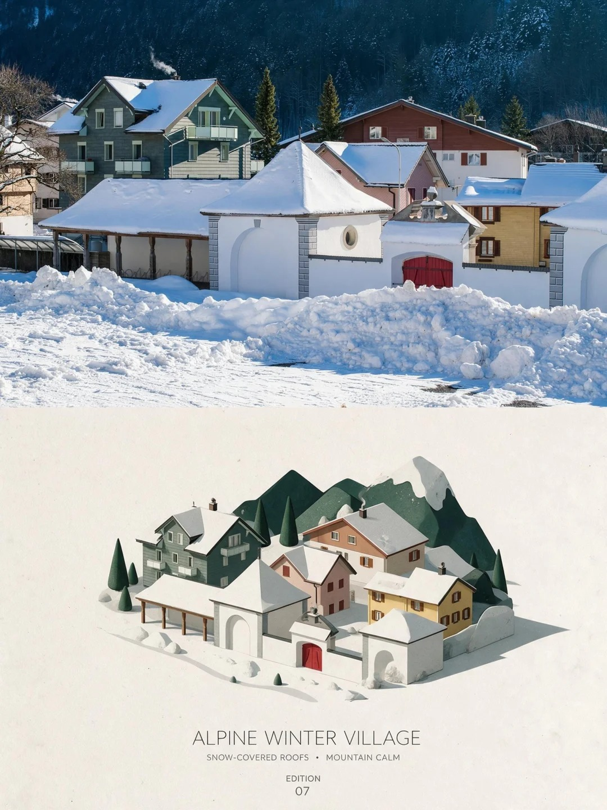
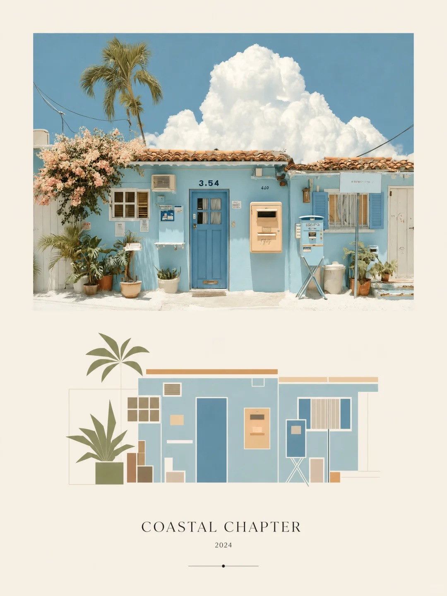
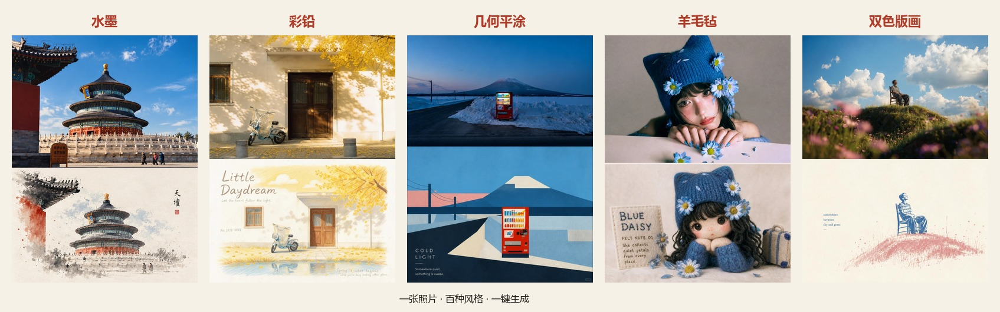

# StyleForge · 提示词海报工坊

> 项目一句话：**挑选一个艺术风格，上传你的照片，一键生成同风格的艺术海报。**
> 更进一步：不只有照片改造——还能**拼装**和**生成**专属于你的提示词。

本文档是 StyleForge 的完整功能说明与海报生成提示词方案，供设计讨论使用。文中所有生成示例图由下方对应提示词产出。

---

## 一、产品定位

AI 图像生成的最大痛点不是"生成不了"，而是"说不清想要什么"。StyleForge 的答案是把"说清楚"这件事**工程化**：

- 我们从社交媒体整理了 **145+ 组经过验证的提示词**（每组都带真实样例图），覆盖水墨、彩铅、几何平涂、羊毛毡、版画、剪纸等 30+ 种风格；
- 用户**不需要会写提示词**——挑一张喜欢的样例图，上传照片，就能得到同款风格的海报；
- 想要定制？用"提示词拼装器"像搭积木一样选择风格 / 色彩 / 文字 / 情绪 / 禁忌，实时拼出完整的提示词；
- 完全没有照片？用"原创生成"板块的模板提示词，填空就能生成文旅海报、节日海报。

**目标用户**：想拯救旅行废片的普通人、需要快速出风格化海报的自媒体作者、想学习提示词写法的 AI 绘画爱好者。

**使用场景**（三步闭环）：

```
浏览风格库（看着样例选） → 上传照片生成 → 对比效果、换风格重试 / 下载分享
```

---

## 二、核心功能模块

### 2.1 风格库（核心资产）

- **双板块结构**：
  - **照片改造**（145 组）：上传照片 → img2img，上半区保留原片、下半区风格化重构，"废片拯救"是主打场景；
  - **原创生成**（新增板块）：无需照片 → txt2img，模板化提示词（如城市文旅海报），填空即用。
- 每个风格包含：**编号（NO.048 式索引）、风格名、标签（版式 / 原片处理 / 风格媒介 / 色彩 / 文字 / 质感 / 情绪 / 禁忌八维分类）、全部样例图、完整提示词**；
- **搜索引擎式检索**：首页大搜索框，按风格名 / 标签 / 编号实时联想（下拉带缩略图）；标签 chips 筛选（手绘 20+、插画 50+……）；
- **提示词彩色高亮**：提示词正文按八维分类上色显示（风格=朱砂红加粗、版式=蓝、色彩=赭黄、禁忌=灰+删除线），用户一眼看懂"一段提示词由什么构成"——这既是功能也是教学。

### 2.2 生成器（核心转化）

- 上传照片（拖拽 / 点击）→ 选风格（可多选最多 3 个）→ 生成；
- **生成结果 = 上下对照视图**：原片在上、风格化结果在下，拖动分界线对比——效果好坏一目了然；
- 支持下载、"换个风格再生成"；
- 当前为 mock 演示模式，接入中转站 image2 后即为真实生成（接口层已解耦，只换一个文件）。

### 2.3 定制提示词（拼装器）

不依赖 LLM 的结构化生成：

- **槽位选择**：风格引擎（12 选 1：水墨 / 彩铅 / 几何平涂 / 炭笔素描 / 厚涂油画 / 羊毛毡 / 韩式扁平 / 纸艺剪纸 / 双色错版 / 等距微缩 / 水彩贴纸手帐 / 黑线涂鸦小人）× 色彩策略（5 选 1）× 文字方案（4 选 1）× 情绪（多选）× 禁忌清单（默认全选）；
- **实时拼装 + 彩色预览**：右边栏即时输出完整提示词（同样按分类上色），一键复制；
- **互斥规则引擎**：内置设计规则——炭笔素描强制黑白（自动剔除彩色策略）、水墨禁高饱和撞色、羊毛毡配柔和色、贴纸手帐强制无文字，触发时弹提示说明原因；
- 所有片段提炼自库内验证过的提示词，"拼出来的就是能用的"。

### 2.4 原创生成（新板块）

- 针对"没有照片也想生成海报"的场景；
- 首批模板：**城市文旅海报**（3D 微缩城市沙盘、等距鸟瞰、填入城市名与地标即可）；
- 计划扩展：节日海报、活动宣传、壁纸生成等模板化提示词。

### 2.5 作品广场（占位）

- 用户作品展示 + 点赞 + "做同款"跳转（二期功能，当前为占位页）。

---

## 三、信息架构

```
首页 /                —— 品牌区 + 大搜索框 + 热门标签 + 样例走马灯 + 三步流程 + 精选风格
├── /styles           —— 风格库（双板块 Tab + 标签筛选 + 搜索）
│   └── /styles/[id]  —— 风格详情（样例画廊 + 彩色提示词 + 复制 + "用这个风格试试"）
├── /compose          —— 定制提示词拼装器
├── /create           —— 生成器（上传 → 多选风格 → 对照结果）
└── /community        —— 作品广场（占位）
```

**视觉语言**：纸色背景（米白 #f6f1e7）+ 墨色文字 + 朱砂红点缀（#b23a26），衬线标题（Noto Serif SC）+ 编号式排版（NO.093），整体是"艺术杂志 / 编辑出版"气质——与产品的艺术海报属性一致。

---

## 四、库内提示词示例（引用）

以下三段直接引自库内已验证的提示词，展示我们的质量水准与写法范式。

### 示例 1 · 组93 几何平涂插画（照片改造）

> 请将我上传的每一张照片分别制作成一张独立的高级设计海报……下半部分提取照片中最具识别性的**主体、轮廓、结构、姿态与叙事关系**，重构为具有 **Geometric stylization / Geometric simplification** 特征的现代主义几何平涂插画。不是用几何线条去描绘主体，而是直接把主体本身压缩成矩形、梯形、三角形、圆形及少量自由块面，以最少形状保留最关键的身份特征，使人一眼能够认出原物。造型采用**大面积平涂色块 + 轻微手绘式不规则边缘 + 哑光水粉 / 丙烯质感**……

### 示例 2 · 组01 水墨风（照片改造）

> 画面为 3:4 竖版构图，上下分为两个区域，比例严格 1:1……下半区：极简水墨重构区。先提炼原照最具记忆点的主体、轮廓、结构走势，再将同一场景重构为极简水墨材料感景观。主体以水墨晕染、干湿交叠、飞白、渗化、积墨、留白的方式重构……用墨以黑、灰、淡墨为主，层层递进，可从原照中提取最有生命力的颜色做少量点染，但整体仍以墨色和留白为主导。

### 示例 3 · 原创生成 · 城市文旅海报（填空模板）

> 一张竖版高级城市文旅海报，主题为【北京冬季城市图鉴】，画面采用精致的3D微缩城市沙盘风格，等距鸟瞰视角……右侧主体是一座漂浮在雪地上的立体城市模型，包含【城市地标1】、【城市地标2】、【城市地标3】……左侧大面积留白，用于排版城市名称、英文副标题、坐标、图例说明。画面色调为雪白、米白、冰蓝、浅灰、香槟金和暖橙色……

**写法范式总结**（拼装器据此设计）：版式骨架（3:4 上下对半）→ 原片处理（保留+杂志调色）→ 风格化引擎（各家精华段）→ 色彩策略 → 文字规则 → 禁忌清单。五段式中只有"风格化引擎"是真正的变量，其余高度复用——这就是"拼装能保证质量"的结构基础。

---

## 五、海报生成提示词方案

### 5.1 主海报 · 「风格铸造工坊」概念图

**用途**：首页 hero 区主视觉 / 黑客松展板。把"照片进 → 风格库熔炼 → 海报出"的产品逻辑翻译成一座 3D 微缩工坊。

```
一张竖版高级产品概念海报，主题为【StyleForge · 提示词海报工坊】，画面采用精致的3D微缩工坊场景风格，等距鸟瞰视角，像一座「风格铸造工坊」的立体模型，是高端文创产品的概念插画封面。

场景核心是一条从左到右的转化流程：左侧是一叠微微翘起的真实旅行照片（风景、人物、街角各一张，边缘带着胶片质感）；照片流向中央的「风格熔炉」——一座多层旋转卡片架，每层插满不同风格的小卡片（水墨青灰、彩铅暖色、几何色块、羊毛毡米白、版画双色……色彩各异、错落有致），熔炉顶部飘出细小的彩色粒子与墨迹；右侧输出一排精美装裱的竖版艺术海报，每张海报呈上下对照结构——上半是原照片、下半是风格化重构的插画，一眼看懂「照片变海报」的全过程。

工坊底部是温暖的木质工作台，散落少量写满字的提示词卡片、一支钢笔和一枚朱砂红印章。整体像独立设计工作室的宣传页、概念店的开业海报。

左侧大面积留白，用于排版「StyleForge」衬线大标题、中文副标题「提示词海报工坊」、英文短句「Pick a style. Forge your art.」、以及【风格总数 145+】和【核心功能：风格库 / 一键生成 / 提示词拼装】的小型线性图例说明，整体像高端杂志的编辑排版。

画面色调为米白、暖棕纸感为主，朱砂红作点缀色，辅以少量青蓝与赭黄，柔和工作室灯光，细腻阴影，电影级光影，超高细节，精致模型质感，梦幻但真实，优雅、安静、有收藏感的视觉。

竖版构图，超高清，细节丰富，3D render, isometric miniature workshop, style library card catalog, before-and-after poster wall, elegant product concept poster, soft cinematic lighting, premium editorial layout
```

### 5.2 流程图海报 · 三步工作流

**用途**：功能说明页 / 演示 slide。三联画式呈现核心用户旅程。

```
一张横版高级信息图海报，主题为【StyleForge 使用流程】，采用优雅的编辑排版风格，像高端杂志的专题信息图页。

画面分为三个等宽的纵向板块，由左至右呈现使用流程，板块之间用细线分隔：

第一板块「01 · 挑选风格」：一只手从一整面风格卡片墙中抽出一张卡片，卡片墙上密集排列着不同风格的小样例图（水墨、彩铅、几何、羊毛毡、剪纸各具色彩），每张卡片带编号标签；

第二板块「02 · 上传照片」：一张真实旅行照片被放入相框，照片上方悬浮一个上传图标，周围有虚线引导线；

第三板块「03 · 生成海报」：一张竖版海报从旧式印刷机中缓缓输出，海报呈上下对照结构——上半是刚才那张旅行照片，下半已变成优美的水墨风格插画。

每个板块底部有编号与标题的排版文字区。背景为温暖的米白色纸张质感，带细腻纸纤维。配色为墨黑、朱砂红点缀、赭黄与青蓝辅助，整体安静、优雅、有收藏感，像一套精心设计的版画。横版构图，超高细节，editorial infographic, three-panel workflow, vintage print machine, elegant paper texture
```

### 5.3 风格演示海报 · 「一照多变」

**用途**：展示"同一张照片 × 不同风格"的核心卖点。最能打动用户的一张图。

```
一张竖版高级演示海报，主题为【一张照片，百种风格】，展示 StyleForge 的核心能力。

画面中央偏上是一张真实照片（一个穿红色外套的旅行者站在京都街角的屋檐下，真实摄影质感）作为"原图"。从这张原图向下辐射出五张竖版小海报，呈扇形排列，每张小海报都是原图经不同风格重构后的效果，上下对照结构：

最左：水墨风——下半区化为宣纸上的极简水墨，大面积留白与朱砂小印；
左中：彩铅手绘风——下半区是带纸纹颗粒的彩铅插画，笔触清晰温暖；
正中：几何平涂风——下半区把人物压缩成几何色块拼贴，现代主义海报感；
右中：羊毛毡风——下半区变成一只针毡材质的小玩偶，纱线卷发、手工质感；
最右：双色版画风——下半区是错版印刷的青红双色插画，带网点颗粒。

五张小海报之间用细线与原图相连。背景为米白纸色，排版少量文字：顶部「StyleForge」衬线标题，底部一行小字「一张照片 · 百种风格 · 一键生成」。整体像一场精心策划的展览海报，安静优雅，色彩克制而各风格鲜明。竖版构图，超高细节，one photo five styles, fan layout demonstration, exhibition poster aesthetic
```

---

## 六点五、核心代码（技术实现参考）

以下代码展示项目的四个关键技术实现，完整代码在 `web/` 目录（Next.js 16 + TypeScript + Tailwind v4）。

### A. 数据管线：组文件夹 → 风格库（Python）

整个库的入库流程全自动——把小红书爬来的 `组XX_风格名/提示词.txt+图片` 放进板块目录，跑一次脚本即上架：

```python
# web/scripts_build_styles.py（节选）
def scan_board(board_dir: Path, style_type: str):
    """扫描板块目录下的 组XX_风格名 文件夹，返回 styles 条目并拷贝图片"""
    out = []
    for folder in sorted(board_dir.iterdir()):
        m = re.match(r"组(\d+)_(.+)", folder.name)
        if not folder.is_dir() or not m: continue
        num, name = m.group(1), m.group(2)
        prompt = (folder / "提示词.txt").read_bytes().decode("utf-8-sig").strip()
        images = sorted(f.name for f in folder.iterdir() if f.suffix.lower() == ".jpg")
        dest = PUB / f"{style_type}-{num}"      # 板块前缀，避免跨板块编号冲突
        # ... 拷贝图片到 public/styles/
        out.append({"id": f"{style_type}-{num}", "num": num, "name": name,
                    "type": style_type, "prompt": prompt, "tags": auto_tags(name)})
    return out

styles = scan_board(COLLECTION, "transform") + scan_board(GENERATION, "generate")
```

配套的**标签学习台账**（`web/scripts/extract_tags.py`）实现"边学边扩"：词表（`lexicon.json`，8 分类 72 词条）+ 台账（`tag_state.json` 记录每组的提示词哈希与所学词表版本），每次运行报告哪些组是新来的、哪些提示词变了、哪些高频词还没进词表：

```python
# 学习状态判定（extract_tags.py 节选）
new     = [g for g in groups if g not in state]                      # 新组，未学习
changed = [g for g in groups if state.get(g, {}).get("hash") != groups[g]["hash"]]  # 内容变更
stale   = [g for g in groups if state.get(g, {}).get("learned_v") < lex["version"]] # 词表升级后待重学
```

### B. 提示词拼装引擎（TypeScript，纯函数可测试）

`lib/compose.ts` 接收槽位选择，输出完整提示词 + 彩色高亮区间 + 规则触发提示：

```typescript
// lib/compose.ts（节选）
export function compose(sel: Selection): ComposeResult {
  const notices: string[] = [];
  let { style, color, text, mood = [], avoid = [] } = sel;

  // 1) 应用互斥/联动规则
  for (const rule of RULES) {
    if (rule.when.option !== style) continue;
    if (rule.force && text !== rule.force.option) {      // 如：贴纸手帐 → 强制无文字
      text = rule.force.option; notices.push(rule.note);
    }
    for (const f of rule.forbid ?? []) {                  // 如：炭笔素描 → 剔除彩色策略
      if (f.slot === "color" && color === f.option) { color = undefined; notices.push(rule.note); }
    }
  }

  // 2) 逐段拼接：骨架(版式/原片保留) + 风格引擎 + 色彩 + 文字 + 情绪 + 禁忌合并
  // 3) 记录每段的字符区间 spans → 前端按分类上色渲染
  ...
}
```

互斥规则库（设计知识显式化）：

```typescript
export const RULES = [
  { when: { slot: "style", option: "sticker-journal" },
    force: { slot: "text", option: "none" },
    note: "水彩贴纸手帐风格要求下半区无文字，已自动切换为「无文字」" },
  { when: { slot: "style", option: "charcoal" },
    forbid: [{ slot: "color", option: "vivid" }, { slot: "color", option: "limited" }],
    note: "炭笔素描为单色黑白，与彩色策略互斥" },
  { when: { slot: "style", option: "ink-wash" },
    forbid: [{ slot: "color", option: "vivid" }],
    note: "水墨以墨色与留白为主导，禁高饱和撞色" },
  // ... 羊毛毡禁高饱和等
];
```

### C. 生成服务解耦层（接中转站 image2 只改一个文件）

```typescript
// lib/mock.ts —— 当前 mock 实现
export async function mockGenerate(styleId: string): Promise<string> {
  await sleep(1400 + Math.random() * 1200);          // 模拟生成耗时
  const style = getStyle(styleId);
  return style.images[Math.floor(Math.random() * style.images.length)];
}
// 接入真实 image2 时：新建 lib/generate.ts 调中转站 API，
// create-client.tsx 里把 mockGenerate 换成真实现，页面代码零改动
```

### D. before/after 对照滑块（自研组件，无第三方依赖）

```tsx
// components/compare-slider.tsx（节选）—— pointer 事件 + clip-path 实现
<div onPointerDown={(e) => { dragging.current = true; update(e.clientX); }}
     onPointerMove={(e) => dragging.current && update(e.clientX)} ...>
  {after}                                            {/* 底层：风格化结果 */}
  <div style={{ clipPath: `inset(0 ${100 - pos}% 0 0)` }}>{before}</div>  {/* 上层：原片，按位置裁切 */}
  <div className="absolute inset-y-0 w-px bg-white/90" style={{ left: `${pos}%` }}>
    <span className="...">↔</span>                   {/* 拖动手柄 */}
  </div>
</div>
```

---

以下示例图由上述提示词（及库内提示词）生成，作为海报方案的视觉参考。

### 示例 A · 主海报「风格铸造工坊」概念图



### 示例 B · 流程图海报「三步工作流」



### 示例 C · 风格演示「一照多变」



---

## 六、生成示例图

以下示例图作为海报方案的视觉参考。其中「一照多变」由库内五风格真样例合成（可直接使用）；另两张为方向占位图（等距微缩风 / 极简图解风），请用 5.1、5.2 的提示词在 ChatGPT 生成真实海报后替换。

### 示例 A · 主海报「风格铸造工坊」概念图（方向占位：等距微缩风）


### 示例 B · 流程图海报「三步工作流」（方向占位：极简图解风）


### 示例 C · 风格演示「一照多变」（库内样例合成，可用）


---

## 七、讨论议题（给 ChatGPT 的话）

我们计划用上述提示词生成项目宣传海报，想在以下方面讨论：

1. **主海报方向**：3D 微缩工坊（5.1）是否是表达产品的最佳隐喻？备选方向：编辑杂志封面风（更贴网站视觉）、电影海报风（库内已有成熟提示词）？
2. **文案定稿**：「Pick a style. Forge your art.」vs 中文口号「挑一个风格，炼一张海报」，哪个更适合作主 slogan？
3. **一照多变（5.3）**：五个风格的选取是否最优？是否换成辨识度更高的组合（如换成剪纸、贴纸手帐）？
4. **视觉一致性**：海报如何与网站视觉（米白 + 朱砂红 + 编号排版）保持统一而不单调？

---

*StyleForge · 黑客松项目 · 2026-09*
