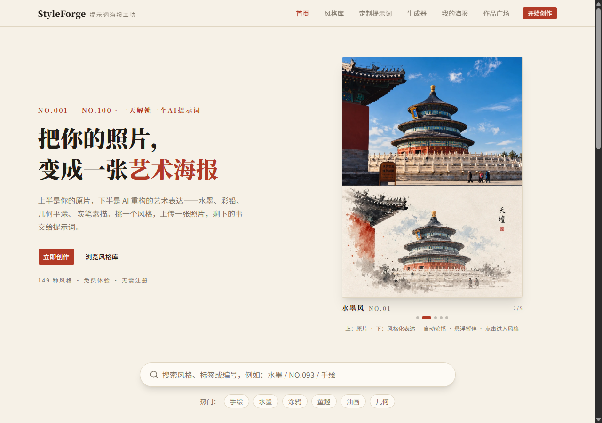
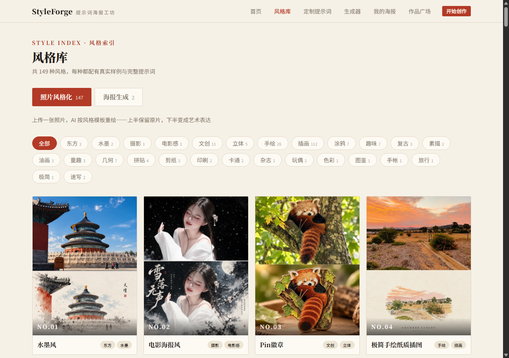
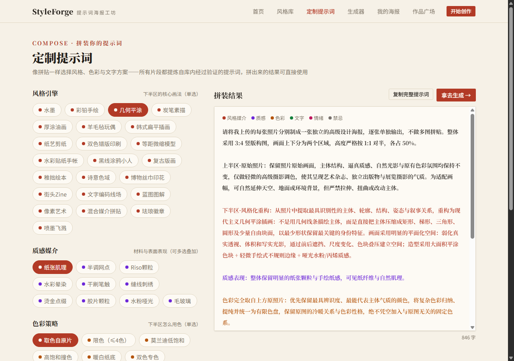
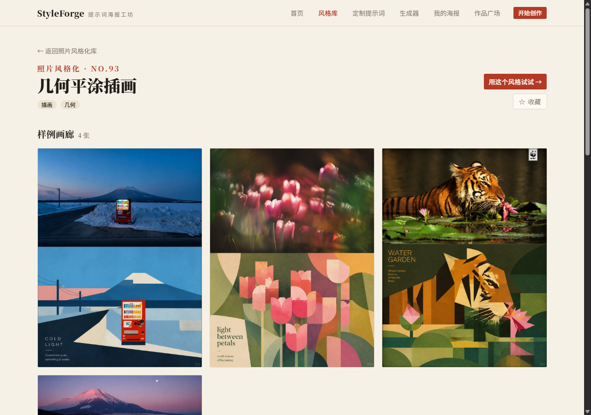

# 「StyleForge」图片风格转换工具介绍文档

**使用说明：**

1. **请先创建副本**，再基于副本修改使用 创建副本

2. 每一节内容建议控制在 **200 字以内**

3. 能用图表 / 截图表达的内容，请优先使用视觉呈现

4. 分享链接时请设置【**互联网获得链接的人**】【**可阅读**】，避免影响评审

## 一、作品概览 

- **作品名称**：StyleForge

- **介绍：**

  一个 AI 海报生成工具站：内置 **149 组经过验证的提示词模板**（水墨、彩铅、几何平涂、羊毛毡、版画、剪纸等 30+ 种风格，每组配真实样例图），用户**不需要会写提示词**——看样例挑风格、上传照片，就能一键得到同款风格的艺术海报。还提供提示词拼装器（23 风格引擎 × 10 质感媒介自由组合）与原创海报模板，覆盖"改造照片"到"从零生成"的完整需求。

## 二、为什么做

1. **受众是谁？** 18–35 岁的内容创作者与普通用户：想让随手拍变成"能晒出来"的图的人、需要快速产出风格化海报的自媒体作者、想学提示词写法但不知从何下手的 AI 绘画爱好者。

2. **你想为他们创造什么？** 解决"AI 能生成好图，但我说不清想要什么"的痛点。真实观察：小红书"一天解锁一个AI提示词"系列单帖数千赞、评论区清一色"求提示词"——大家认得出好效果，却复制不了。我们把验证过的提示词**工程化成产品**：挑样例即选风格，效果所见即所得。

3. **现有体验还缺什么？** 直接对话生图：描述门槛高、结果靠抽卡；现成提示词帖：只能复制粘贴，无法预览、不能调整；设计工具：学习成本高。缺一个"提示词被组织成可浏览、可预览、可组装的资产库"的中间层。

## 三、做了什么

### 核心设计功能
#### 功能 1 

**功能名称：** 双板块风格库 + 一键同款生成

**设计意图 / 解决的问题：** 把 149 组提示词变成"看图选风格"的浏览体验——搜索引擎式联想检索、八维标签筛选、提示词彩色高亮（一眼看懂提示词结构）。选定后上传照片，服务端代理 gpt-image 图生图（比例可选 3:4/1:1/16:9），结果以 **before/after 滑动对照**呈现，效果好坏一目了然。

#### 功能 2

**功能名称：** 提示词拼装器（/compose）

**设计意图 / 解决的问题：** 不依赖 LLM 的结构化提示词生成。把提示词拆解为 **23 风格引擎 × 10 质感媒介（多选叠加）× 7 色彩策略 × 4 文字方案 × 情绪/禁忌** 的槽位组合，全部片段提炼自库内验证过的措辞——"拼出来的就是能用的"。内置互斥规则引擎（炭笔强制黑白、水墨禁高饱和等），实时彩色预览，「拿去生成」直通生成器。

#### 功能 3

**功能名称：** 边学边扩的标签体系

**设计意图 / 解决的问题：** 8 分类 87 词条词表 + **学习台账**（记录每组的提示词哈希与所学词表版本）自动解析全部模板：新模板入库即被扫描，报告未学习/内容变更的组与候选新词，人工审阅后词表升级——数据扩张时标签体系随之生长，提示词彩色高亮覆盖率已达 69%。

## 四、产品相关链接

1. **在线演示链接**：

   - 电脑端：https://creating-century-burlington-veteran.trycloudflare.com/
   - 手机端：扫描下方二维码进入移动版（含精选风格库 / 生成海报 / 共享画廊）

   

   > 注：演示部署经 Cloudflare 隧道由本地服务器提供，若链接临时不可用，可在评审前联系我们重启隧道。

2. **代码仓库链接**：https://github.com/YangAn8800/StyleForge

3. **在线Demo链接（如有）**：同 1

## 五、技术选型

1. **主要工具或模型：**

| 工具/模型 | 角色与功能 |
|---|---|
| **gpt-image（OpenAI Images API）** | 图生图核心模型，服务端反向代理调用（支持中转站/自定义端点/代理，密钥永不暴露前端） |
| **Next.js 16 + TypeScript** | 站点框架（App Router，SSG 预渲染 149 个风格详情页） |
| **Tailwind CSS v4 + shadcn/ui** | 设计系统：纸色 + 朱砂红的编辑排版视觉语言 |
| **Python 数据管线** | 组文件夹扫描入库、词表引擎 + 学习台账（正则提取 + 哈希变更检测） |
| **自研前端组件** | before/after 对照滑块、画廊式灯箱（平滑滑动切换 + 两侧缩略导航）、拼装引擎（纯函数可单测） |

2. **数据资产**：149 组提示词模板、689 张样例图、8 分类 87 词条标签词表（v5）——由自研爬取/解析管线从小红书"一天解锁一个AI提示词"等公开系列整理。
